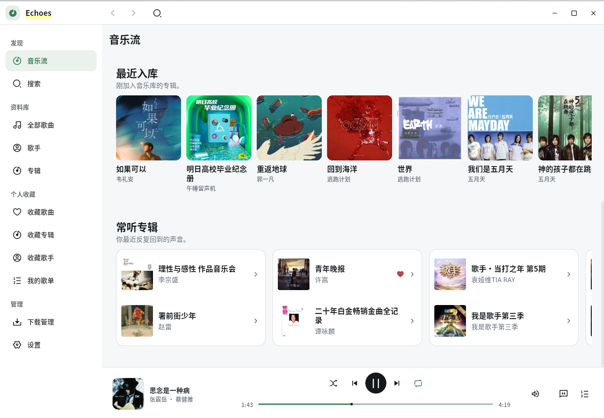
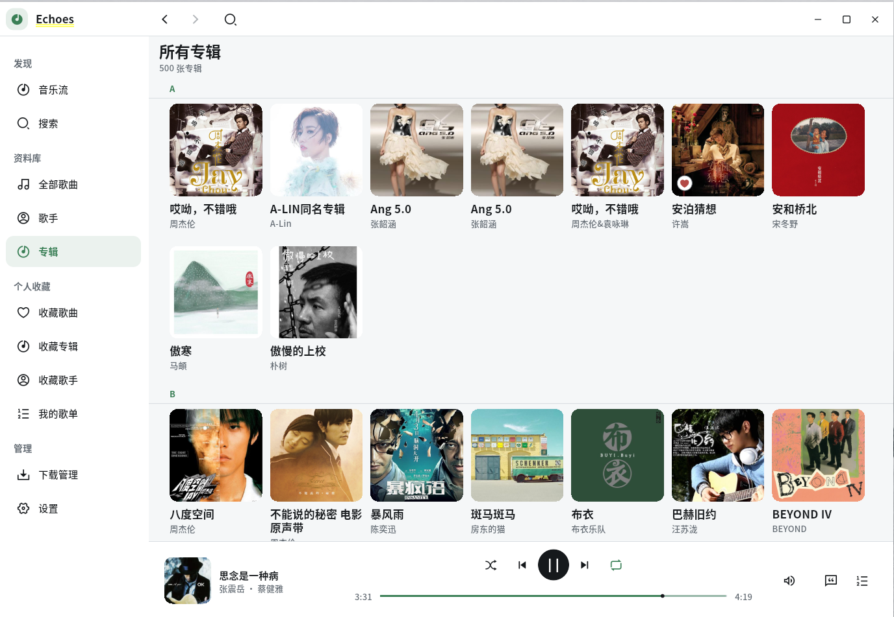
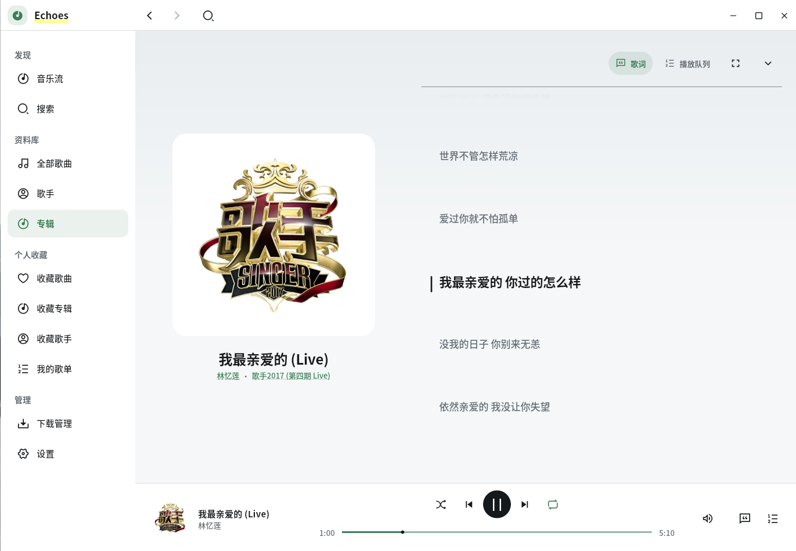
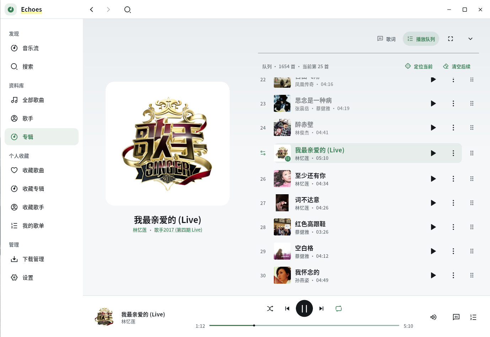
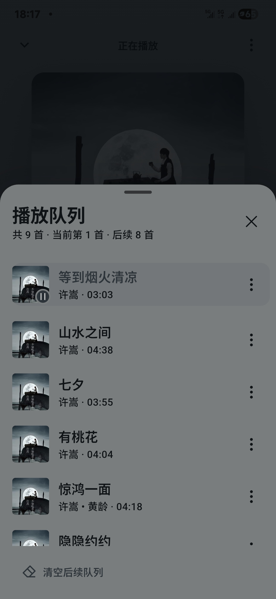

# Echoes / 回响

Echoes 是一款面向自建音乐库的跨平台播放器，基于 Flutter，兼容 Navidrome、Subsonic 与 OpenSubsonic 服务。

本项目 fork 自 [Azincc/echo](https://github.com/Azincc/echo)，当前项目地址为 [github.com/Ericwyn/echoes](https://github.com/Ericwyn/echoes)。

## 体验与设计

- **为不同屏幕设计**：Android 使用底部导航、迷你播放器与沉浸式播放页；Ubuntu 桌面使用侧边导航、统一标题栏和常驻播放控制栏。
- **让音乐成为视觉中心**：专辑封面、随封面变化的播放器背景、同步歌词与播放队列，在手机和桌面上采用各自合适的布局。
- **管理自己的音乐库**：浏览歌曲、歌手、专辑、歌单与收藏；支持多个音乐库和多条服务器线路，在连接异常时切换可用地址。
- **融入系统播放体验**：Android 支持后台播放和系统媒体控制；Linux 支持 MPRIS 媒体控制与系统托盘。歌曲下载与本地缓存让常听内容随时可用。

## 界面截图

### Ubuntu 桌面

| 音乐流 | 专辑资料库 |
| --- | --- |
|  |  |
| **同步歌词** | **播放队列** |
|  |  |

### Android

| 音乐流 | 曲库 | 播放器 | 播放队列 |
| --- | --- | --- | --- |
|  |  |  |  |

## 平台与构建

Android 和 Ubuntu/Linux 是当前重点适配的平台。仓库也包含 iOS、macOS、Windows 和 Web 工程，这些平台仍在持续适配与验证。

编译 Android APK 或 Linux DEB、便携版时，请参阅 [BUILD.md](BUILD.md)。

本项目基于 [MIT](LICENSE) 许可证开源。
