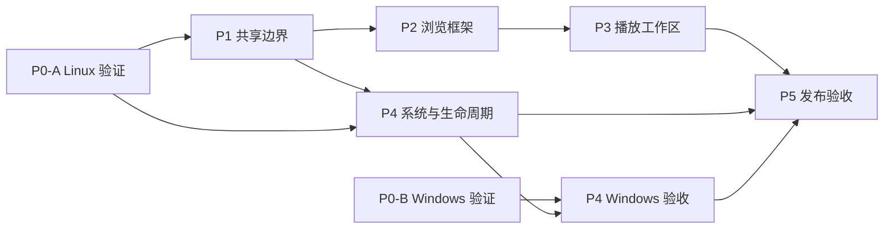

# 桌面端适配

创建日期：2026-09-23。更新：2026-09-24。状态：**分阶段实施中，以 Ubuntu/Linux 为当前验证目标**。

目标：同一 Flutter 工程复用 Android/Linux/Windows 播放与数据核心，为桌面提供完整资料库导航、常驻播放条、封面与歌词/队列工作区、系统媒体控制、托盘以及可安装产物。当前优先验证用户的 Ubuntu 22.04 + GNOME 42 + X11；Windows CI 暂缓，相关代码和实机能力仍标记为未验证。

目前桌面侧栏、常驻播放条、歌词/队列工作区、Linux MPRIS 和托盘已有首轮实现。用户确认 Ubuntu 系统媒体卡片能控制播放并显示封面，托盘基础功能正常，音量条外观可接受。桌面与手机路由策略分开，目的地定义共享；桌面隐藏账户/服务器底栏和离线状态入口，Linux 顶栏已将 Echo 标识、历史导航和搜索合并，播放栏贴齐主面板，手机窄屏抽屉保留移动入口。封面动态背景可持久化关闭；退出保存恢复快照，托盘 watcher 可处理宿主重启；首次选择关闭到后台时，会说明托盘/任务栏恢复方式并等待用户确认。托盘菜单新增上一首，播放/暂停标签与可用状态依据共享快照更新，菜单命令改由 listener 单点派发。路由前进复用 PageStorageBucket，搜索/筛选/滚动、收藏标签和曲库列表状态逐步接入；`1de36904` 与 `685ea3db` 为设置、搜索、下载、收藏、专辑/歌单详情、音乐库编辑、元数据编辑和离线任务页补齐稳定滚动状态键。全部歌曲页滚动时复用数据签名，避免封面预加载窗口更新反复扫描整份曲库；长队列当前项定位记录已渲染行索引和队列 revision，并在滚动后清理离屏 `GlobalKey`；桌面队列标题栏新增“定位当前”入口，队列行按宽度显示序号、专辑和时长，窄空间隐藏专辑。P1 已抽出共享播放进度/transport widget、`SongActionFactory`、`PlaybackCommands`、`PlaybackSnapshot`、`AudioSpecFormatter` 和 `PlayerTrackIdentity`；播放按钮、队列、键盘快捷键、Linux 托盘与同步歌词 seek 使用统一命令入口；无效位深不再显示为 `0bit`。`87b994e3` 补上桌面队列双击播放；`9cbc98fa` 加入桌面全屏模式，Esc 优先退出全屏且正常窗口尺寸不会被全屏分辨率覆盖；Android 不显示原生全屏按钮。`23729951` 接入共享音质格式化，`14f39032` 统一迷你/完整播放页的歌名、副标题和 Hero 包装，`8f51f1fc` 加入首次关闭到后台提示，`94b7a2ab` 修正托盘菜单双重派发并接入快照状态，`ba35b87d` 为共享快照加入 libraryId、sourceGeneration 与 bufferedPosition，并让 MPRIS/SMTC 按库和音源隔离曲目封面。`6f0f80e6` 将恢复会话按音乐库隔离，切库时停止旧播放器并清理系统媒体元数据；Android AudioService 作为进程级单例复用并安全重绑命令。`a6ee5e65` 修正添加/编辑音乐库流程的返回目标，保留原 Navigator 历史。`67f62407` 在添加库认证成功后先保存并停止旧播放器，再激活新库；失败时恢复旧播放器并清理未激活的新库记录。`d85868f1` 让删除非活动库不切换当前库，活动库删除失败时回登录态而不保留失效引用。`cab6fe11` 删除音乐库后清空桌面前进历史，播放会话清理失败也不会把页面留在已删除实体上。`46453bb2` / `b12aa608` 统一队列播放命令；`c4bd0b6e` 防止 queue startIndex 越界。`54207f92` 修正 Linux MPRIS 的 Shuffle/LoopStatus 与 track identity；`d6bb46f5` 补上关窗时托盘宿主丢失的最小化恢复路径；`8acd46dd` 让 Wayland focus 被拒绝时仍保留正确可见状态；`bb8d9af3` 为这些恢复策略补上可单测逻辑与用例。`b0bc5800` 补齐桌面紧凑播放栏控制，`5f0f429d` 改用可访问的 `MenuAnchor`，`c7455cf0` 独立随机/循环状态并兼容旧设置；`24e5319e` 串行处理随机/循环命令，避免 MPRIS 并发写入覆盖状态。Linux `.deb`/bundle ZIP 最新为干净构建的 `1.1.0+2060`；原签名 Android ARM64 APK versionCode `2056` 已随旧 `build/` 清理，未重新构建。产物未安装或启动；新增并发回归未运行。窗口/DPI、紧凑播放栏交互、全屏桌面操作、MPRIS seek、托盘故障恢复、1654/5000 首 release/profile 性能、干净安装及 Android 真机回归仍待实测。按用户要求不启动应用或运行测试，手动交互由用户执行。

最近应用代码检查点：`2e15f875` 合并 Linux 单行顶栏并恢复 GTK 原生窗口装饰，`d16e5952` 修正干净构建的 native-assets manifest 校验并将版本升至 `1.1.0+2060`。旧 `build/` 已清空，当前仅保留 `build/linux/x64/release/bundle/` 及 `build/linux/packages/` 中的最新 DEB/ZIP；目录约 141 MB。新 DEB SHA-256 `b337215395589079fafb42d59e46115f8fbd3ca696cdb83a58c196b43e97d575`，ZIP SHA-256 `001dde6f32658890d65f3db38aba0e5e09924c10e653b765a59774ab126779db`。Android 旧 APK 已随清理删除，本机签名脚本仍由 `.git/info/exclude` 忽略。最新构建证据见[干净 Linux 构建](evidence/260924-clean-linux-build/README.md)。

## 阅读入口

| 文档 | 回答的问题 |
| --- | --- |
| [总体设计](desktop-adaptation-plan.md) | 为什么改、界面如何组织、哪些代码复用、平台边界是什么 |
| [决策记录](decisions.md) | 哪些是用户要求，哪些只是推荐默认值，哪些需要技术验证 |
| [音流技术参考](research-stream-music.md) | 两篇开发笔记对播放分层、Windows SMTC、封面和打包验证的启发 |
| [P0：平台可行性](phase-0-platform-spike.md) | Linux 媒体会话、托盘和工具链的已验证部分及缺口；Windows 独立记录 |
| [P1：共享播放与组件边界](phase-1-shared-foundation.md) | 如何保持一个播放器和一套队列，解决音量与组件耦合 |
| [P2：桌面浏览框架](phase-2-desktop-shell.md) | 如何合并导航、接入子页面、构建首页和完整播放条 |
| [P3：播放工作区](phase-3-player-workspace.md) | 如何实现封面固定、歌词/队列切换、鼠标与键盘操作 |
| [P4：系统集成与生命周期](phase-4-system-integration.md) | 如何完成 MPRIS/SMTC、托盘、关窗、退出、单实例和恢复 |
| [P5：打包与跨端验收](phase-5-release-validation.md) | 如何交付 Ubuntu/Windows 包并证明 Android 没有退化 |
| [需求与验收矩阵](acceptance.md) | 什么算完成，各平台还缺哪些证据 |

## 阶段依赖与交付点

继续以 Linux 本机编译和测试推进。Windows CI 暂不作为当前门槛；Windows 原生桥接若保留在工作树中，仍需独立 Windows 编译与桌面会话验收后才能标记完成。阶段依赖表示代码/证据依赖，不是启动并行代理的要求。

| 阶段 | 当前状态 | 离开阶段的关键条件 |
| --- | --- | --- |
| P0 | Linux 部分通过 | Ubuntu 22.04/libmpv 0.34 兼容路径已验证；全新 CMake build-dir 构建需要 LLD 14，系统 LLVM 目录当前未安装。使用从 Ubuntu 包解压至 `/tmp` 的真实 LLD 14 后构建成功，未改系统。runner 已改为 GTK 单实例并复用现有窗口；二次启动、MPRIS seek、托盘恢复和干净环境交互证据仍待补 |
| P1 | 部分实现 | 单播放器、命令/快照、用户音量、封面缓存、共享 metadata 和导航模型已接入；`682907f3` 抽出跨桌面/手机消费的播放进度与控制 widget，`7e0c991b` 将歌曲操作抽象为 `SongAction`，`f8b026cb` 将动作构造移到 `SongActionFactory` 并让 presenter 统一负责关闭，避免重复 pop；`7eea69e9`、`8149800f` 让桌面/手机播放控件、队列、快捷键、托盘和歌词 seek 通过 `PlaybackCommands`，`76b964af` 让桌面播放条/transport 控件选择 `PlaybackSnapshot`，`23729951` 抽出共享音质格式化并忽略非正位深，`14f39032` 统一迷你/完整播放页的歌曲身份与 Hero 文本；`ba35b87d` 将 libraryId、sourceGeneration 和 bufferedPosition 加入共享快照，并让 MPRIS/SMTC 按库与音源隔离曲目封面；`c7455cf0` 让 `setLoopMode`/`setShuffleEnabled` 独立更新、双状态持久化并迁移旧的合并模式，移动端原四模式循环保留；`24e5319e` 串行化 setter、toggle、cycle 与恢复操作，避免并发写入读取旧状态。Linux `1.1.0+2058` 与 Android ARM64 `2056` release 编译通过；新增并发回归未运行，最终自动回归与 Android 实机回归仍待补 |
| P2 | 桌面统一返回/前进栈及主要浏览状态恢复已实现，等待用户复测 | 手机保留分支路由，桌面使用单 Navigator；无账户/服务器底栏与离线任务状态页；Linux 单行顶栏、播放条贴边；前进复用 PageStorageBucket，搜索、音乐流展开、曲库列表、全部歌曲两种排序模式、详情排序、收藏页签及滚动位置、歌手内容区、Explore 查询/草稿/滚动位置，以及设置/下载/专辑歌单详情/音乐库与歌曲编辑页滚动位置可恢复；`df403891` 补充两层详情 LIFO 返回/前进恢复及新导航清空前进栈回归定义，未运行；窗口与页面状态仍待用户验证 |
| P3 | 首轮实现中 | 宽屏/紧凑工作区、歌词/队列切换与关闭重开后的状态保留、队列右键、可关闭的封面动态背景、拖动冲突提示、“定位当前”、桌面单击选中/双击播放及可选系统全屏已实现；Esc 先退出全屏，普通窗口尺寸不会被全屏分辨率覆盖，Android 不显示该系统窗口入口；相关用例未运行，Ubuntu 全屏操作、release/profile 性能采样和真实窗口验收待补 |
| P4 | Linux 基础可用 | 用户确认 MPRIS 控制/封面与托盘基础功能；单实例、关窗选择、首次关闭到后台恢复提示、动态托盘控制、下载退出提示及 SetPosition/Seeked/error 隔离已编译；`0e832ddb` 增加 watcher 断线退避重连和 destroy 失败恢复；`e34563ef` 修复退出恢复与初始 watcher 查询的竞争；`9abb3e09` 抽出 show/minimize 兜底并新增 3 条回归定义；`c7455cf0` 让 MPRIS `Shuffle` 和 `LoopStatus` setter 调用互不清除对方状态；`24e5319e` 串行化异步模式写入并补并发回归定义。Linux `1.1.0+2058` 与签名 Android ARM64 `2056` release 已构建；回归未运行，GNOME MPRIS setter/seek 与生命周期仍待用户实测 |
| P5 | Linux `1.1.0+2060` DEB/bundle ZIP 已从空 `build/` 编译 | 当前 `build/` 约 141 MB；DEB 与 ZIP 均位于 `build/linux/packages/`，ZIP 完整性和 DEB 元数据检查通过。旧 Android APK 已清理，本次未重打；产物未安装或启动，Flutter tests/analyze 未运行，Ubuntu 手动验收仍待执行。最新证据：[干净 Linux 构建](evidence/260924-clean-linux-build/README.md) |

- **M1 可试用版**：P1、P2 加 P4 的基础 Linux 媒体会话；旧完整播放器可暂作过渡。托盘恢复尚未通过时，不开放关闭后隐藏窗口。
- **M2 Ubuntu 桌面候选版**：P3、P4-Linux 和 P5-Linux 完成，并通过共享代码的 Android 回归。
- **M3 双桌面正式范围**：补齐 P0-B、P4-Windows、P5-Windows，才宣称 Windows 同等支持。

## 实施时如何使用

1. 先读总体设计与决策，再读当前 phase；按前置条件选择工作，不需要将整份 spec 一次实现。
2. 一个 phase 可以拆成多个小提交；提交说明引用 phase 与验收用例编号。
3. 每次更新在对应 phase 的实施记录中填写提交、实际变更、检查结果、遗留项；验收状态统一更新到 `acceptance.md`。
4. 接口或产品行为发生变化时先更新对应设计/决策，再同步受影响 phase，避免各阶段自行定义不同规则。
5. 新增事实证据放 `evidence/<日期>-<平台>-<主题>/`，正文使用相对链接，不依赖临时目录、聊天附件路径或开发者私有目录。

相关约束：[既有队列语义](../260922-play-queue-redesign/play-queue-redesign.md)、[播放可靠性验证](../260918-playback-reliability-testing/playback-reliability-testing.md)、[UI 设计计划](../260715-echo-ui-overhaul-plan/echo-ui-overhaul-plan.md)。
