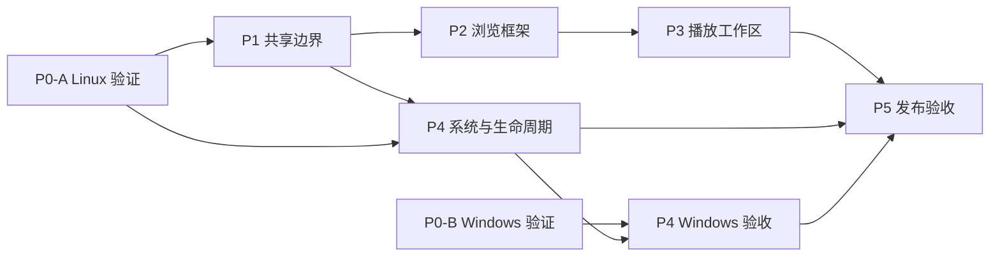

# 桌面端适配

创建日期：2026-09-23。更新：2026-09-23。状态：**分阶段实施中，以 Ubuntu/Linux 为当前验证目标**。

目标：同一 Flutter 工程复用 Android/Linux/Windows 播放与数据核心，为桌面提供完整资料库导航、常驻播放条、封面与歌词/队列工作区、系统媒体控制、托盘以及可安装产物。当前优先验证用户的 Ubuntu 22.04 + GNOME 42 + X11；Windows CI 暂缓，相关代码和实机能力仍标记为未验证。

目前桌面侧栏、常驻播放条、歌词/队列工作区、Linux MPRIS 和托盘已有首轮实现。用户确认 Ubuntu 系统媒体卡片能控制播放并显示封面，托盘基础功能正常，音量条外观可接受。导航/窗口改造检查点为 `7f4ae955`；用户随后报告 Linux 自绘窗口栏点击异常和闪烁，代码已移除依赖路由 Overlay 的 Tooltip，并在启动时恢复普通窗口状态、最小化/最大化/缩放能力。按用户要求，修正后的 release 和自动测试没有重跑，等用户自行启动验收。长队列/窗口尺寸、完整 MPRIS seek、关窗恢复/单实例、干净安装与 Android 最终实机回归仍待验收。

最近实现检查点：`f6100044`（Linux 优先桌面适配首轮）。

## 阅读入口

| 文档 | 回答的问题 |
| --- | --- |
| [总体设计](desktop-adaptation-plan.md) | 为什么改、界面如何组织、哪些代码复用、平台边界是什么 |
| [决策记录](decisions.md) | 哪些是用户要求，哪些只是推荐默认值，哪些需要技术验证 |
| [音流技术参考](research-stream-music.md) | 两篇开发笔记对播放分层、Windows SMTC、封面和打包验证的启发 |
| [P0：平台可行性](phase-0-platform-spike.md) | Linux 媒体会话、托盘和工具链的已验证部分及缺口；Windows 独立记录 |
| [P1：共享播放与组件边界](phase-1-shared-foundation.md) | 如何保持一个播放器和一套队列，解决音量与组件耦合 |
| [P2：桌面浏览框架](phase-2-desktop-shell.md) | 如何合并导航、接入子页面、构建首页和完整播放条 |
| [P3：播放工作区](phase-3-player-workspace.md) | 如何实现封面固定、歌词/队列切换、鼠标与键盘操作 |
| [P4：系统集成与生命周期](phase-4-system-integration.md) | 如何完成 MPRIS/SMTC、托盘、关窗、退出、单实例和恢复 |
| [P5：打包与跨端验收](phase-5-release-validation.md) | 如何交付 Ubuntu/Windows 包并证明 Android 没有退化 |
| [需求与验收矩阵](acceptance.md) | 什么算完成，各平台还缺哪些证据 |

## 阶段依赖与交付点

继续以 Linux 本机编译和测试推进。Windows CI 暂不作为当前门槛；Windows 原生桥接若保留在工作树中，仍需独立 Windows 编译与桌面会话验收后才能标记完成。阶段依赖表示代码/证据依赖，不是启动并行代理的要求。

| 阶段 | 当前状态 | 离开阶段的关键条件 |
| --- | --- | --- |
| P0 | Linux 部分通过 | 锁定 Ubuntu 22.04/libmpv 0.34 兼容路径；补 MPRIS seek、恢复/单实例和干净环境证据 |
| P1 | 部分实现 | 单播放器、命令/快照、用户音量和封面缓存已接入；补 metadata 共用边界及 Android 最终实机回归 |
| P2 | 桌面统一返回/前进栈和 Linux 自绘窗口栏已实现，等待用户复测 | 手机保留分支路由，桌面使用单 Navigator；Linux 隐藏 GTK 标题栏并绘制全局窗口栏，主页面保留应用导航工具栏，最小宽度锁定 840；用户报告过按钮点击/闪烁问题，Overlay 依赖已移除，修正后的窗口操作由用户验收 |
| P3 | 首轮实现中 | 固定封面、动态背景、歌词/队列切换已实现；补焦点/快捷键、长队列和窗口尺寸验收 |
| P4 | Linux 基础可用 | 用户确认 MPRIS 控制/封面与托盘基础功能；补完整 seek、托盘宿主失效、关窗恢复与单实例 |
| P5 | Linux release 已编译 | 做干净 Ubuntu 安装/播放与 Android 回归；Windows CI 和 Windows 实机验收暂缓 |

- **M1 可试用版**：P1、P2 加 P4 的基础 Linux 媒体会话；旧完整播放器可暂作过渡。托盘恢复尚未通过时，不开放关闭后隐藏窗口。
- **M2 Ubuntu 桌面候选版**：P3、P4-Linux 和 P5-Linux 完成，并通过共享代码的 Android 回归。
- **M3 双桌面正式范围**：补齐 P0-B、P4-Windows、P5-Windows，才宣称 Windows 同等支持。

## 实施时如何使用

1. 先读总体设计与决策，再读当前 phase；按前置条件选择工作，不需要将整份 spec 一次实现。
2. 一个 phase 可以拆成多个小提交；提交说明引用 phase 与验收用例编号。
3. 每次更新在对应 phase 的实施记录中填写提交、实际变更、检查结果、遗留项；验收状态统一更新到 `acceptance.md`。
4. 接口或产品行为发生变化时先更新对应设计/决策，再同步受影响 phase，避免各阶段自行定义不同规则。
5. 新增事实证据放 `evidence/<日期>-<平台>-<主题>/`，正文使用相对链接，不依赖临时目录、聊天附件路径或开发者私有目录。

相关约束：[既有队列语义](../260922-play-queue-redesign/play-queue-redesign.md)、[播放可靠性验证](../260918-playback-reliability-testing/playback-reliability-testing.md)、[UI 设计计划](../260715-echo-ui-overhaul-plan/echo-ui-overhaul-plan.md)。
