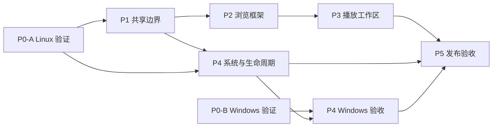

# 桌面端适配

创建日期：2026-09-23。状态：**设计讨论稿，P0–P5 均未实施**。

目标：同一 Flutter 工程复用 Android/Linux/Windows 播放与数据核心，为桌面提供完整资料库导航、常驻播放条、封面与歌词/队列工作区、系统媒体控制、托盘以及可安装产物。第一实机目标为用户的 Ubuntu 22.04 + GNOME 42 + X11；Windows 有独立构建和实机验收要求。

现有 Linux release 编译成功是基础事实，不代表新桌面 UI、MPRIS 或托盘已实现。本文档整理和 phase 拆分也不改变这一状态。

## 阅读入口

| 文档 | 回答的问题 |
| --- | --- |
| [总体设计](desktop-adaptation-plan.md) | 为什么改、界面如何组织、哪些代码复用、平台边界是什么 |
| [决策记录](decisions.md) | 哪些是用户要求，哪些只是推荐默认值，哪些需要技术验证 |
| [音流技术参考](research-stream-music.md) | 两篇开发笔记对播放分层、Windows SMTC、封面和打包验证的启发 |
| [P0：平台可行性](phase-0-platform-spike.md) | 如何验证 Linux/Windows 媒体会话、托盘和工具链选型 |
| [P1：共享播放与组件边界](phase-1-shared-foundation.md) | 如何保持一个播放器和一套队列，解决音量与组件耦合 |
| [P2：桌面浏览框架](phase-2-desktop-shell.md) | 如何合并导航、接入子页面、构建首页和完整播放条 |
| [P3：播放工作区](phase-3-player-workspace.md) | 如何实现封面固定、歌词/队列切换、鼠标与键盘操作 |
| [P4：系统集成与生命周期](phase-4-system-integration.md) | 如何完成 MPRIS/SMTC、托盘、关窗、退出、单实例和恢复 |
| [P5：打包与跨端验收](phase-5-release-validation.md) | 如何交付 Ubuntu/Windows 包并证明 Android 没有退化 |
| [需求与验收矩阵](acceptance.md) | 什么算完成，各平台还缺哪些证据 |

## 阶段依赖与交付点

P0-A 完成即可推进共享代码与 Ubuntu 界面。Windows 设备暂不可用时，P0-B 记录为待验证；不阻塞 Linux 界面工作，也不能把 Windows 系统集成标记完成。阶段依赖表示代码/证据依赖，不是启动并行代理的要求。

| 阶段 | 当前状态 | 离开阶段的关键条件 |
| --- | --- | --- |
| P0 | 待实施 | Linux 选型实验通过并留记录；Windows 通道与缺口明确 |
| P1 | 实施中 | 单播放器、稳定命令/快照、用户音量保持、Android 相关回归通过 |
| P2 | 实施中 | 单导航和常驻完整播放条；子页面与浏览历史稳定 |
| P3 | 实施中 | 歌词/宽队列切换、大队列操作、缩放与焦点行为通过 |
| P4 | 待实施 | UI/系统/托盘控制一致；关窗可恢复、退出和单实例通过 |
| P5 | 待实施 | 干净环境安装与实际播放、平台证据齐全、发布范围准确 |

- **M1 可试用版**：P1、P2 加 P4 的基础 Linux 媒体会话；旧完整播放器可暂作过渡。托盘恢复尚未通过时，不开放关闭后隐藏窗口。
- **M2 Ubuntu 桌面候选版**：P3、P4-Linux 和 P5-Linux 完成，并通过共享代码的 Android 回归。
- **M3 双桌面正式范围**：补齐 P0-B、P4-Windows、P5-Windows，才宣称 Windows 同等支持。

## 实施时如何使用

1. 先读总体设计与决策，再读当前 phase；按前置条件选择工作，不需要将整份 spec 一次实现。
2. 一个 phase 可以拆成多个小提交；提交说明引用 phase 与验收用例编号。
3. 每次更新在对应 phase 的实施记录中填写提交、实际变更、检查结果、遗留项；验收状态统一更新到 `acceptance.md`。
4. 接口或产品行为发生变化时先更新对应设计/决策，再同步受影响 phase，避免各阶段自行定义不同规则。
5. 新增事实证据放 `evidence/<日期>-<平台>-<主题>/`，正文使用相对链接，不依赖临时目录、聊天附件路径或开发者私有目录。

相关约束：[既有队列语义](../260922-play-queue-redesign/play-queue-redesign.md)、[播放可靠性验证](../260918-playback-reliability-testing/playback-reliability-testing.md)、[UI 设计计划](../260715-echo-ui-overhaul-plan/echo-ui-overhaul-plan.md)。
