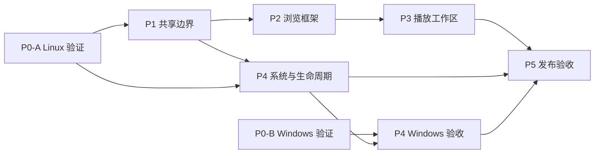

# 桌面端适配

创建日期：2026-09-23。更新：2026-09-23。状态：**分阶段实施中，以 Ubuntu/Linux 为当前验证目标**。

目标：同一 Flutter 工程复用 Android/Linux/Windows 播放与数据核心，为桌面提供完整资料库导航、常驻播放条、封面与歌词/队列工作区、系统媒体控制、托盘以及可安装产物。当前优先验证用户的 Ubuntu 22.04 + GNOME 42 + X11；Windows CI 暂缓，相关代码和实机能力仍标记为未验证。

目前桌面侧栏、常驻播放条、歌词/队列工作区、Linux MPRIS 和托盘已有首轮实现。用户确认 Ubuntu 系统媒体卡片能控制播放并显示封面，托盘基础功能正常，音量条外观可接受。桌面与手机路由策略分开，目的地定义共享。最近按用户反馈移除了桌面账户/服务器底栏与离线任务状态入口，统一了左侧品牌区和主导航工具栏高度，并让桌面播放条贴齐主面板边缘；窄屏抽屉仍保留远端离线任务状态页。播放页现有默认开启、本机持久化的封面动态背景开关，关闭后使用当前主题颜色。退出清理会逐步限时并在单项失败时继续；桌面退出先保存播放快照，防止 native stop 和 Provider dispose 将恢复进度覆盖为零。托盘宿主状态现分别跟踪 KDE/freedesktop watcher，并处理初始查询竞态与宿主重启后的重新注册。前进重建路由时复用原 PageStorageBucket，保存页面滚动位置；搜索页恢复已提交查询和未完成输入，曲库/专辑/歌单排序、收藏页签和歌手详情状态可恢复。播放工作区在返回浏览后保持挂载，歌词/队列切换保留各自状态。当前 `bcf9993e` 增加 MPRIS 显式 seek revision，避免普通进度采样误发 `Seeked`；Linux x64 bundle 与 `1.1.0+2028` amd64 `.deb` 已在全新 build-dir 构建，Android arm64 APK 的 version code 为 `4028`。系统 LLVM 目录缺少 linker，构建时把 Ubuntu 官方 `lld-14` 包解压至 `/tmp`，未安装系统软件。两端产物均已做签名/包元数据检查，未安装或启动。新增 MPRIS seek 用例、托盘、历史恢复和工作区保持用例未运行；其他页面局部状态、窗口栏交互、单实例、长队列实机性能、绝对 MPRIS seek、托盘宿主重启、干净安装和 Android 最终实机回归仍待验收。按用户要求，不启动应用或运行测试；手动交互由用户执行。

最近应用代码检查点：`bcf9993e`（含桌面路由/状态恢复 `c9db7c96`）；当前版本 `1.1.0+2028`；Linux 自定义 bundle 打包支持提交：`c25e22aa`。

## 阅读入口

| 文档 | 回答的问题 |
| --- | --- |
| [总体设计](desktop-adaptation-plan.md) | 为什么改、界面如何组织、哪些代码复用、平台边界是什么 |
| [决策记录](decisions.md) | 哪些是用户要求，哪些只是推荐默认值，哪些需要技术验证 |
| [音流技术参考](research-stream-music.md) | 两篇开发笔记对播放分层、Windows SMTC、封面和打包验证的启发 |
| [P0：平台可行性](phase-0-platform-spike.md) | Linux 媒体会话、托盘和工具链的已验证部分及缺口；Windows 独立记录 |
| [P1：共享播放与组件边界](phase-1-shared-foundation.md) | 如何保持一个播放器和一套队列，解决音量与组件耦合 |
| [P2：桌面浏览框架](phase-2-desktop-shell.md) | 如何合并导航、接入子页面、构建首页和完整播放条 |
| [P3：播放工作区](phase-3-player-workspace.md) | 如何实现封面固定、歌词/队列切换、鼠标与键盘操作 |
| [P4：系统集成与生命周期](phase-4-system-integration.md) | 如何完成 MPRIS/SMTC、托盘、关窗、退出、单实例和恢复 |
| [P5：打包与跨端验收](phase-5-release-validation.md) | 如何交付 Ubuntu/Windows 包并证明 Android 没有退化 |
| [需求与验收矩阵](acceptance.md) | 什么算完成，各平台还缺哪些证据 |

## 阶段依赖与交付点

继续以 Linux 本机编译和测试推进。Windows CI 暂不作为当前门槛；Windows 原生桥接若保留在工作树中，仍需独立 Windows 编译与桌面会话验收后才能标记完成。阶段依赖表示代码/证据依赖，不是启动并行代理的要求。

| 阶段 | 当前状态 | 离开阶段的关键条件 |
| --- | --- | --- |
| P0 | Linux 部分通过 | Ubuntu 22.04/libmpv 0.34 兼容路径已验证；全新 CMake build-dir 构建需要 LLD 14，系统 LLVM 目录当前未安装。使用从 Ubuntu 包解压至 `/tmp` 的真实 LLD 14 后构建成功，未改系统。runner 已改为 GTK 单实例并复用现有窗口；二次启动、MPRIS seek、托盘恢复和干净环境交互证据仍待补 |
| P1 | 部分实现 | 单播放器、命令/快照、用户音量、封面缓存、共享 metadata 和导航模型已接入；AudioService 兜底播放不再重置用户音量；补自动回归执行、音量竞争覆盖、歌曲动作边界及 Android 最终实机回归 |
| P2 | 桌面统一返回/前进栈及主要浏览状态恢复已实现，等待用户复测 | 手机保留分支路由，桌面使用单 Navigator；无账户/服务器底栏与离线任务状态页；品牌区/主工具栏对齐、播放条贴边；前进复用 PageStorageBucket，搜索、详情排序、收藏页签和歌手内容区可恢复；其他页面状态与新增回归仍待验证 |
| P3 | 首轮实现中 | 宽屏/紧凑工作区、歌词/队列切换与关闭重开后的状态保留、队列右键、可关闭的封面动态背景已实现；5000 首定位和本轮用例未运行；长队列性能采样和真实窗口验收待补 |
| P4 | Linux 基础可用 | 用户确认 MPRIS 控制/封面与托盘基础功能；单实例、关窗选择、下载退出提示及 SetPosition/Seeked/error 隔离已编译；Seeked 现依据成功 seek revision 发送，新增测试未运行；watcher 别名、查询竞态和重新注册已修正，宿主仍待验收 |
| P5 | 当前 Linux `1.1.0+2028` bundle/.deb 与 Android arm64 APK 均已构建 | Linux 使用系统 Clang 和从 Ubuntu 包解压至 `/tmp` 的真实 LLD 14；Debian 包版本 `1.1.0+2028`、amd64，元数据/文件已核对。Android arm64 APK 使用本机 release keystore 签名，version code 4028，签名和包信息已校验。两端均未安装或启动，Android 真机回归和干净 Ubuntu 播放待验；Windows CI 和 Windows 实机验收暂缓 |

- **M1 可试用版**：P1、P2 加 P4 的基础 Linux 媒体会话；旧完整播放器可暂作过渡。托盘恢复尚未通过时，不开放关闭后隐藏窗口。
- **M2 Ubuntu 桌面候选版**：P3、P4-Linux 和 P5-Linux 完成，并通过共享代码的 Android 回归。
- **M3 双桌面正式范围**：补齐 P0-B、P4-Windows、P5-Windows，才宣称 Windows 同等支持。

## 实施时如何使用

1. 先读总体设计与决策，再读当前 phase；按前置条件选择工作，不需要将整份 spec 一次实现。
2. 一个 phase 可以拆成多个小提交；提交说明引用 phase 与验收用例编号。
3. 每次更新在对应 phase 的实施记录中填写提交、实际变更、检查结果、遗留项；验收状态统一更新到 `acceptance.md`。
4. 接口或产品行为发生变化时先更新对应设计/决策，再同步受影响 phase，避免各阶段自行定义不同规则。
5. 新增事实证据放 `evidence/<日期>-<平台>-<主题>/`，正文使用相对链接，不依赖临时目录、聊天附件路径或开发者私有目录。

相关约束：[既有队列语义](../260922-play-queue-redesign/play-queue-redesign.md)、[播放可靠性验证](../260918-playback-reliability-testing/playback-reliability-testing.md)、[UI 设计计划](../260715-echo-ui-overhaul-plan/echo-ui-overhaul-plan.md)。
